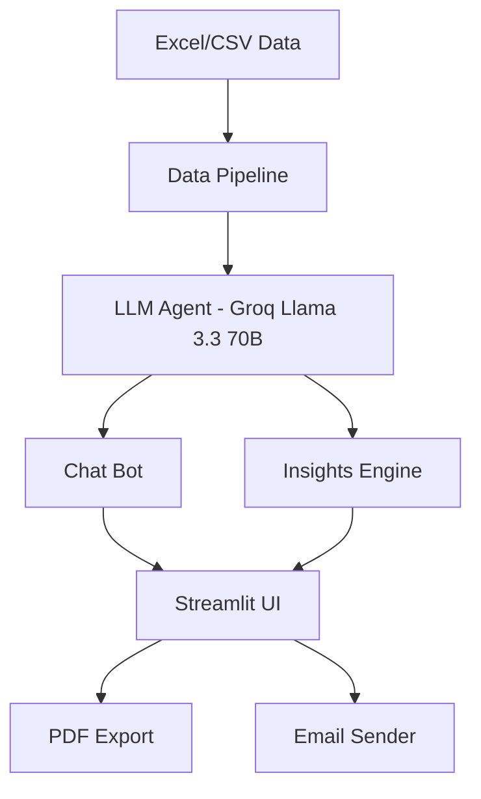

# 🟠 Rappi Ops Intelligence

Sistema de Análisis Inteligente para Operaciones Rappi — AI Engineer Assessment

## Descripción

Rappi Ops Intelligence es una plataforma de análisis operacional que combina un bot conversacional en lenguaje natural con un motor de detección automática de insights. El sistema permite a los equipos de operaciones explorar datos de 9 países, 964 zonas y 13 métricas semanales mediante preguntas en español, sin necesidad de escribir código. Además, genera reportes ejecutivos automatizados que identifican anomalías, tendencias, oportunidades y correlaciones en la red de operaciones, exportables a PDF y enviables por email.

## Demo en Vivo

**🔗 [rappi-ops-intelligence.onrender.com](https://rappi-ops-intelligence.onrender.com/)**

> **Nota:** La aplicación está desplegada en la instancia gratuita de Render, por lo que la primera carga puede tomar 1-3 minutos mientras el servidor se inicializa (cold start). Una vez activa, funciona con normalidad. Si prefieres una experiencia más rápida, puedes correr la aplicación localmente siguiendo la guía de setup más abajo.

## Arquitectura



## 🛠️ Stack Tecnológico

| Componente | Tecnología |
|---|---|
| LLM | Groq — Llama 3.3 70B Versatile |
| Frontend | Streamlit 1.45 |
| Data Processing | Pandas 2.2 + NumPy |
| Visualización | Plotly 6.0 |
| Export | fpdf2 (PDF) + smtplib (Email) |
| Deploy | Docker + Render.com |

## Setup Local

### Prerrequisitos

- Python 3.11+
- API Key de Groq (gratuita en [console.groq.com](https://console.groq.com))

### Instalación

```bash
git clone https://github.com/gabrielpadilla24/rappi-ops-intelligence.git
cd rappi-ops-intelligence
python -m venv venv
source venv/bin/activate  # Windows: venv\Scripts\activate
pip install -r requirements.txt
cp .env.example .env
# Editar .env con tu GROQ_API_KEY
```

### Datos

El archivo Excel `data/rappi_data.xlsx` está incluido en el repositorio ya que contiene datos dummy anonimizados y randomizados proporcionados para el assessment (no representan un país ni período específico). Esto permite que tanto el deploy en Render como la ejecución local funcionen directamente sin configuración adicional de datos.

### Ejecución

```bash
streamlit run app.py
```

La app estará disponible en `http://localhost:8501`

## Estructura del Proyecto

```
rappi-ops-intelligence/
├── app.py                    # Entry point Streamlit
├── src/
│   ├── data_pipeline.py      # Carga, limpieza, enriquecimiento
│   ├── agent.py              # Agente LLM (Groq)
│   └── insights_engine.py    # 5 detectores + síntesis
├── utils/
│   ├── charts.py             # Gráficos Plotly
│   ├── export.py             # Export CSV/PDF
│   └── email_sender.py       # Envío SMTP
├── prompts/
│   ├── system_prompt.py      # System prompt del agente
│   └── insights_prompt.py    # Prompt de insights
├── data/
│   └── rappi_data.xlsx       # Datos dummy del assessment
├── Dockerfile                # Deploy en Render
├── requirements.txt
└── .env.example
```

## Bot Conversacional (70%)

El bot convierte preguntas en lenguaje natural a código pandas ejecutable mediante un pipeline de tres pasos: el LLM genera código Python basado en el esquema de los dataframes, se ejecuta sobre los datos reales, y la respuesta se sintetiza en lenguaje natural junto con un gráfico Plotly automático cuando es relevante.

**Tipos de queries soportados:**

- **Filtrado y ranking** — "¿Cuáles son las 5 zonas con mayor Lead Penetration?"
- **Comparación** — "Compara Perfect Orders entre zonas Wealthy y Non Wealthy en México"
- **Tendencias** — "Muestra la evolución de Gross Profit UE en Chapinero últimas 8 semanas"
- **Agregación** — "¿Cuál es el promedio de Lead Penetration por país?"
- **Multivariable** — "¿Qué zonas tienen alto Lead Penetration pero bajo Perfect Order?"
- **Inferencia** — "¿Cuáles son las zonas que más crecen en órdenes en las últimas 5 semanas?"

El agente mantiene memoria conversacional de los últimos 5 turnos y genera sugerencias proactivas de preguntas relacionadas al final de cada respuesta.

## Insights Automáticos (30%)

El motor de insights ejecuta 5 detectores determinísticos sobre los datos y sintetiza los hallazgos en un reporte ejecutivo mediante el LLM:

1. **Anomalías** — Detecta variaciones semana a semana superiores al ±10% en cualquier métrica
2. **Tendencias** — Identifica tendencias positivas o negativas de 3 o más semanas consecutivas
3. **Benchmarks** — Compara cada zona contra la media de su grupo (país + tipo de zona) usando z-score
4. **Correlaciones** — Detecta pares de métricas con correlación de Pearson superior a 0.5
5. **Oportunidades** — Identifica zonas High Priority con mejora sostenida en 3+ semanas

El LLM sintetiza todos los hallazgos en un reporte ejecutivo en Markdown con resumen ejecutivo, detalle por categoría y recomendaciones accionables por zona y país.

## Bonus Implementados

- ✅ **Visualización de datos** — Gráficos Plotly automáticos (line, bar, scatter, pie, heatmap)
- ✅ **Exportación CSV** — Botón de descarga en cada respuesta del chat que contiene datos
- ✅ **Exportación PDF** — Reporte de insights con formato profesional y branding Rappi
- ✅ **Envío por email** — SMTP/Gmail con PDF adjunto, formulario integrado en la UI

## Costos

| Componente | Costo |
|---|---|
| Groq API | Gratuito (free tier) |
| Streamlit | Gratuito |
| Render deploy | Gratuito (free tier) |
| **Total por sesión** | **$0.00** |

## Limitaciones

- **Seguridad de `exec()`** — El código generado por el LLM se ejecuta con `exec()` en un namespace controlado. En producción se requiere un entorno aislado (e.g. RestrictedPython, subprocess con timeout).
- **Datos estáticos** — Los datos se cargan al inicio de la sesión desde un archivo Excel. No hay conexión en tiempo real a bases de datos ni actualización automática.
- **Fiabilidad del LLM** — El agente puede ocasionalmente generar código pandas inválido o malinterpretar preguntas ambiguas. El retry automático mejora la tasa de éxito pero no la garantiza al 100%.
- **Rate limits de Groq** — El free tier de Groq tiene límites de 30 RPM y 15,000 tokens/minuto. Uso intensivo puede alcanzar estos límites temporalmente.

## Próximos Pasos

- **Sandbox seguro** — Reemplazar `exec()` por un intérprete restringido o contenedor aislado
- **Base de datos en tiempo real** — Conectar a BigQuery o Redshift para datos actualizados
- **Scheduling semanal** — Ejecutar el motor de insights automáticamente cada lunes y distribuir por email
- **Autenticación** — Agregar login con Google/SSO para restringir acceso a usuarios autorizados
- **Alertas proactivas** — Enviar notificaciones a Slack cuando se detecten anomalías críticas

## Contacto

Gabriel Padilla — gabrielpadillab03@gmail.com
