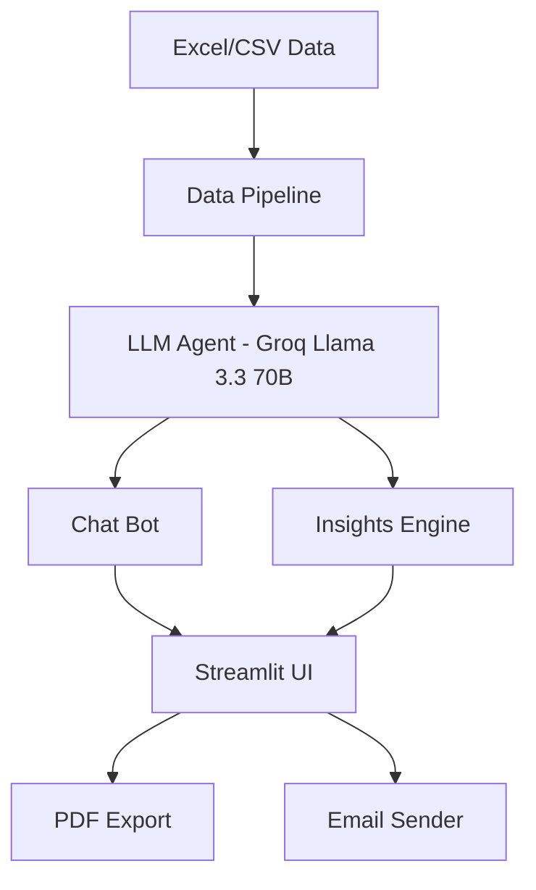

# 🟠 Rappi Ops Intelligence

Sistema de Análisis Inteligente para Operaciones Rappi — AI Engineer Assessment

## Descripción

Rappi Ops Intelligence es una plataforma de análisis operacional que combina un bot conversacional en lenguaje natural con un motor de detección automática de insights. El sistema permite a los equipos de operaciones explorar datos de 9 países, 964 zonas y 13 métricas semanales mediante preguntas en español, sin necesidad de escribir código. Además, genera reportes ejecutivos automatizados que identifican anomalías, tendencias, oportunidades y correlaciones en la red de operaciones, exportables a PDF y enviables por email.

## Arquitectura



## 🛠️ Stack Tecnológico

| Componente | Tecnología |
|---|---|
| LLM | Groq — Llama 3.3 70B Versatile |
| Frontend | Streamlit 1.45 |
| Data Processing | Pandas 2.2 + NumPy |
| Visualización | Plotly 6.0 |
| Export | fpdf2 (PDF) + smtplib (Email) |
| Deploy | Docker + Render.com |

## Setup Local

### Prerrequisitos

- Python 3.11+
- API Key de Groq (gratuita en [console.groq.com](https://console.groq.com))

### Instalación

```bash
git clone https://github.com/gabrielpadilla24/rappi-ops-intelligence.git
cd rappi-ops-intelligence
python -m venv venv
source venv/bin/activate  # Windows: venv\Scripts\activate
pip install -r requirements.txt
cp .env.example .env
# Editar .env con tu GROQ_API_KEY
```

### Datos

Coloca el archivo Excel en `data/rappi_data.xlsx` (no incluido en el repo por `.gitignore`).

### Ejecución

```bash
streamlit run app.py
```

La app estará disponible en `http://localhost:8501`

## Estructura del Proyecto

```
rappi-ops-intelligence/
├── app.py                    # Entry point Streamlit
├── src/
│   ├── data_pipeline.py      # Carga, limpieza, enriquecimiento
│   ├── agent.py              # Agente LLM (Groq)
│   └── insights_engine.py    # 5 detectores + síntesis
├── utils/
│   ├── charts.py             # Gráficos Plotly
│   ├── export.py             # Export CSV/PDF
│   └── email_sender.py       # Envío SMTP
├── prompts/
│   ├── system_prompt.py      # System prompt del agente
│   └── insights_prompt.py    # Prompt de insights
├── data/                     # Datos (gitignored)
├── Dockerfile                # Deploy en Render
├── requirements.txt
└── .env.example
```

## Bot Conversacional (70%)

El bot convierte preguntas en lenguaje natural a código pandas ejecutable mediante un pipeline de tres pasos: el LLM genera código Python basado en el esquema de los dataframes, se ejecuta sobre los datos reales, y la respuesta se sintetiza en lenguaje natural junto con un gráfico Plotly automático cuando es relevante.

Tipos de queries soportados:

- **Filtrado y ranking** — "¿Cuáles son las 10 zonas con menor Perfect Order Rate en Colombia?"
- **Comparación** — "Compara el Lead Penetration entre zonas Wealthy y Non Wealthy en México"
- **Tendencias** — "¿Qué zonas tienen tendencias negativas sostenidas en las últimas 4 semanas?"
- **Agregación** — "¿Cuál es el promedio de Cancel Rate por país?"
- **Multivariable** — "Muestra zonas con alto Cancellation Rate y bajo Perfect Order simultáneamente"
- **Inferencia** — "¿Qué zonas deberían ser prioridad de intervención esta semana?"

El agente mantiene memoria conversacional de los últimos 5 turnos y genera sugerencias proactivas de preguntas relacionadas al final de cada respuesta.

## Insights Automáticos (30%)

El motor de insights ejecuta 5 detectores determinísticos sobre los datos y sintetiza los hallazgos en un reporte ejecutivo mediante el LLM:

1. **Anomalías** — Detecta variaciones semana a semana superiores al ±10% en cualquier métrica
2. **Tendencias** — Identifica tendencias positivas o negativas de 3 o más semanas consecutivas
3. **Benchmarks** — Compara cada zona contra la mediana de su grupo (país + tipo de zona)
4. **Correlaciones** — Detecta pares de métricas con correlación de Pearson superior a 0.7
5. **Oportunidades** — Identifica zonas High Priority con mejora sostenida que merecen reconocimiento o escalamiento

El LLM sintetiza todos los hallazgos en un reporte ejecutivo en Markdown con secciones estructuradas, análisis de causa raíz y recomendaciones accionables por zona y país.

## Bonus Implementados

- ✅ Visualización de datos (Plotly: line, bar, scatter, pie, heatmap)
- ✅ Exportación CSV (en cada respuesta del chat)
- ✅ Exportación PDF (reporte de insights con formato profesional y branding Rappi)
- ✅ Envío por email (SMTP/Gmail con PDF adjunto)

## Costos

| Componente | Costo |
|---|---|
| Groq API | Gratuito (free tier) |
| Streamlit | Gratuito |
| Render deploy | Gratuito (free tier) |
| **Total por sesión** | **$0.00** |

## Limitaciones

- **Seguridad de `exec()`** — El código generado por el LLM se ejecuta con `exec()` sin sandboxing. En producción se requiere un entorno aislado (e.g. RestrictedPython, subprocess con timeout).
- **Datos estáticos** — Los datos se cargan al inicio de la sesión desde un archivo Excel. No hay conexión en tiempo real a bases de datos ni actualización automática.
- **Fiabilidad del LLM** — El agente puede ocasionalmente generar código pandas inválido o malinterpretar preguntas ambiguas, especialmente en queries muy complejos o con typos.
- **Rate limits de Groq** — El free tier de Groq tiene límites de tokens por minuto. Generar el reporte de insights (que procesa grandes cantidades de datos) puede alcanzar el límite en uso intensivo.

## Próximos Pasos

- **Sandbox seguro** — Reemplazar `exec()` por un intérprete restringido o contenedor aislado para ejecutar el código generado por el LLM
- **Base de datos en tiempo real** — Conectar a BigQuery o Redshift para datos actualizados en lugar de archivos estáticos
- **Scheduling semanal** — Ejecutar el motor de insights automáticamente cada lunes y distribuir el reporte por email a los stakeholders
- **Autenticación** — Agregar login con Google/SSO para restringir el acceso a usuarios Rappi
- **Alertas proactivas** — Enviar notificaciones a Slack cuando el motor detecte anomalías críticas sin necesidad de generar el reporte manualmente

## Contacto

Gabriel Padilla — gabrielpadillab03@gmail.com
